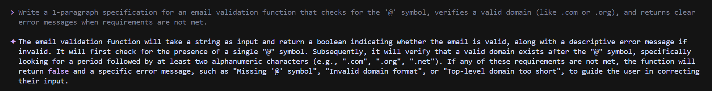

# AI-Driven Development  30-Day Challenge Task -2
-----
***SYEDA AREEBA***

## 📁Part A — Theory

### 1. Nine Pillars Understanding

Q1. Why is using AI Development Agents (like Gemini CLI) for repetitive setup tasks
better for your growth as a system architect?

Using AI Development Agents for setup tasks helps you focus on planning and designing systems rather than doing boring, repetitive work. You save time, learn to solve bigger problems, and become more adaptable to new tools. This lets you develop skills as a system architect, making you a stronger leader in tech.

Q2. Explain how the Nine Pillars of AIDD help a developer grow into an M-Shaped
Developer.

The Nine Pillars of AI-Driven Development teach you skills in many areas not just coding, but also design, teamwork, and using AI tools. By learning all these, you become an M-Shaped Developer, which means you're good at many things and can work on all parts of a project. This makes you flexible and able to handle more challenges in tech.

### Vibe Coding vs Specification-Driven Development

Q1.Why does Vibe Coding usually create problems after one week?

Vibe Coding creates problems after one week because there’s no clear plan—people just write code based on feelings and quick ideas. As time passes, the code gets messy, hard to understand, and difficult to fix or add new features. This makes teamwork confusing and slows everyone down, especially when new changes are needed.

Q2. How would Specification-Driven Development prevent those problems?

Specification-Driven Development prevents those problems by making you plan everything clearly before you start coding. You write down what the system should do, so everyone understands the goal. This means your code is organized, easier to update, and teammates can work together without confusion. It keeps the project on track and avoids messy surprises later.

### Architecture Thinking

Q1. How does architecture-first thinking change the role of a developer in AIDD?

Architecture-first thinking changes the role of a developer in AI-Driven Development by making you focus on designing the system before coding. Instead of just typing code, you plan how everything will work together, solve bigger problems, and make smarter decisions. This turns you from a regular coder into someone who builds strong, reliable systems and leads projects.

Q2. Explain why developers must think in layers and systems instead of raw code?

Developers must think in layers and systems instead of just raw code because this helps keep projects organized and easy to manage. By breaking things into clear parts (like layers), it’s easier to fix problems, add new features, and work with a team. This approach makes software stronger, less confusing, and ready to grow as needs change.

-----

# 📁Part B — Practical Task
## Prompt:

> Write a 1-paragraph specification for an email validation function that checks for the '@' symbol, verifies a valid domain (like .com or .org), and returns clear error messages when requirements are not met.

##### *What I got:*

----
## 📁Part C — Multiple Choice Questions

1. What is the main purpose of Spec-Driven Development?
 ***B. Clear requirements before coding begins***

2. What is the biggest mindset shift in AI-Driven Development?
***B. Thinking in systems and clear instructions***

3. Biggest failure of Vibe Coding?
***B. Architecture becomes hard to extend***

4. Main advantage of using AI CLI agents (like Gemini CLI)?
***B. Handle repetitive tasks so dev focuses on design & problem-solving***

5. What defines an M-Shaped Developer?
***C. Deep skills in multiple related domains***
