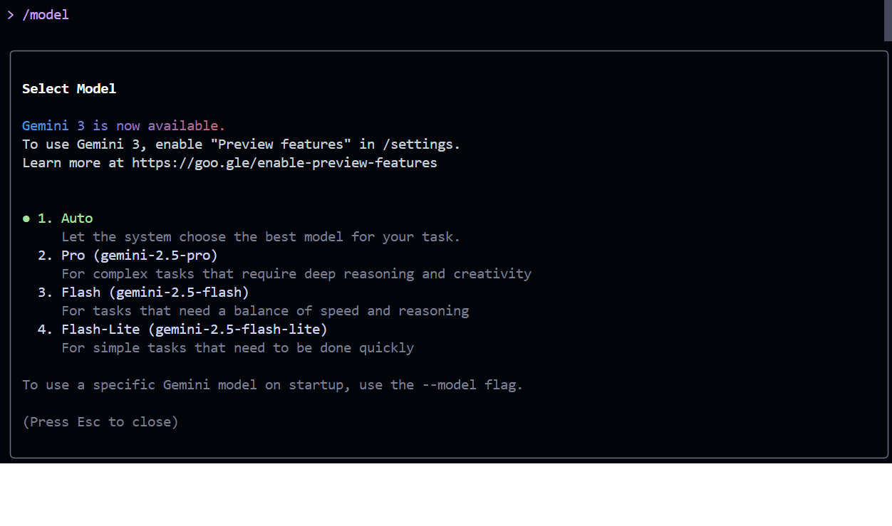

# AI-Driven Development - 30-Day Challenge Task-3

***BY SYEDA AREEBA***
## PART A — Research Questions

Q1.  What new improvements were introduced in Gemini 3.0?

> Gemini 3.0 became much smarter and faster. It now understands not just text, but also pictures, videos, and audio all together.There’s also a special “Deep Think” mode for tough problems.

Q2. How does Gemini 3.0 help with coding and automation?

> It makes programming easier even for beginners. You can just tell Gemini 3.0 what you need, and it helps write the code for you.

Q3. How does Gemini 3.0 handle multimodal understanding?

>That means Gemini 3.0 can “see,” “hear,” and “read” all at once. For example, you can give it a picture and some text, or show it a video clip, and it makes sense of it all together. 

Q4. Name any two helpful tools for developers introduced with Gemini 3.0.

>- **Gemini Agent:** Like a smart helper that can finish complicated coding tasks for you.
>- **Gemini CLI:** This is a tool you can use in your computer’s terminal that lets you talk to Gemini, ask for code, or get help directly 

---
## PART B: Simple To-Do for the Screenshot

***Update the Gemini 3.0 model***

